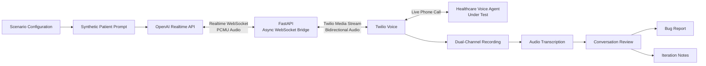

# Real-Time LLM Voice Inference System

**Python · FastAPI · WebSockets · Twilio Voice · OpenAI Realtime API**

A real-time, scenario-driven voice system for testing a healthcare conversational agent over live phone calls.

The system simulates realistic patients using the OpenAI Realtime API, streams bidirectional audio through Twilio Media Streams and an asynchronous FastAPI/WebSocket bridge, records and transcribes calls, and converts the resulting conversations into structured reliability findings.

---

## Project Context

This project was originally developed as part of a **technical hiring assessment for a healthcare voice-agent company**.

The goal of the assessment was to build an automated caller capable of interacting with a provided healthcare voice agent, exercising realistic patient workflows, recording the resulting conversations, identifying reliability issues, and iterating on the testing system based on observed behavior.

This repository contains my implementation of that assessment, including:

- the real-time voice streaming system
- scenario-driven patient simulation
- call recordings and transcripts
- structured bug analysis
- iteration notes
- architecture documentation
- walkthrough recordings

The repository is presented as a portfolio project demonstrating my engineering work during the assessment. It is **not a production healthcare system**, and all patient personas and patient information used in the scenarios are synthetic.

---

## System Overview

The application creates a simulated patient that calls a healthcare voice agent and interacts with it naturally.

A scenario defines the simulated patient's:

- identity
- objective
- relevant information
- opening statement
- conversational behavior

When a test begins:

1. The application selects a scenario.
2. Twilio places an outbound call to the assessment-provided test agent.
3. Twilio connects the call audio to the FastAPI application through a Media Stream.
4. FastAPI establishes a WebSocket connection with the OpenAI Realtime API.
5. Incoming call audio is continuously forwarded to the realtime model.
6. Generated patient audio is streamed back into the live phone call.
7. Twilio records the conversation.
8. The recording is transcribed and reviewed.
9. Reliability issues are documented and used to guide further testing and iteration.

---

## Architecture



### Real-Time Audio Path

```text
Healthcare Voice Agent
        ↕
    Twilio Voice
        ↕
Twilio Media Streams
        ↕ WebSocket
      FastAPI
        ↕ WebSocket
OpenAI Realtime API
        ↕
Synthetic Patient
```

The FastAPI application acts as the real-time bridge between the live phone call and the realtime model.

---

## Key Engineering Work

### Asynchronous Bidirectional Audio Streaming

The core `/media-stream/{scenario_id}` WebSocket endpoint maintains two concurrent audio paths:

```text
Twilio → FastAPI → OpenAI Realtime
OpenAI Realtime → FastAPI → Twilio
```

Two asynchronous tasks run concurrently:

- `twilio_to_openai()` forwards incoming Twilio audio to the realtime model.
- `openai_to_twilio()` streams generated audio from the model back into the live call.

This allows both sides of the conversation to operate continuously without blocking each other.

---

### Realtime Session Configuration

Realtime sessions are configured for:

- `audio/pcmu` input
- `audio/pcmu` output
- semantic voice activity detection
- audio-based responses
- scenario-specific system instructions

Using PCMU in both directions allows the application to pass audio between Twilio and the realtime API without introducing a separate audio conversion pipeline.

---

### Scenario-Driven Patient Simulation

The testing system includes **13 distinct patient scenarios** designed to exercise both standard workflows and edge cases.

| Scenario | Purpose |
|---|---|
| `appointment_basic` | New-patient appointment scheduling |
| `reschedule_existing` | Reschedule an existing appointment |
| `cancel_appointment` | Cancel an appointment |
| `medication_refill` | Medication refill workflow |
| `office_hours_location` | Office hours, location, and parking |
| `insurance_question` | Insurance coverage inquiry |
| `weekend_edge_case` | Weekend scheduling behavior |
| `unclear_request` | Ambiguous patient intent |
| `interruption_test` | Interruption and turn-taking |
| `date_confusion` | Ambiguous date handling |
| `referral_question` | Referral requirement workflow |
| `duplicate_appointment_question` | Duplicate appointment verification |
| `billing_question` | Billing and cost-estimate workflow |

Each scenario contains synthetic patient details and behavioral rules that control how the simulated caller responds during the conversation.

---

### Conversation-Control Rules

The patient simulation includes explicit behavioral constraints to make testing more realistic.

For example, the simulated patient is instructed to:

- answer only the information requested
- handle identity-verification questions before continuing
- avoid jumping ahead during verification
- provide only scenario-defined information
- remain focused on the scenario goal
- behave differently for ambiguity and interruption tests

These rules were refined after reviewing early calls where the simulated patient provided information too quickly or responded unrealistically during verification.

---

### Safety Controls

The application contains an explicit validation step that restricts outbound calls to the **assessment-provided test number**.

Calls are also only initiated when:

```bash
START_CALL=true
```

This prevents an accidental call from being triggered simply by starting the application.

---

## Evaluation Workflow

The system was designed not only to generate conversations but also to create a repeatable evaluation loop.

```text
Scenario
   ↓
Live Test Call
   ↓
Recording
   ↓
Transcription
   ↓
Conversation Review
   ↓
Issue Identification
   ↓
Bug Documentation
   ↓
Prompt / System Iteration
   ↓
Retest
```

Twilio recordings are stored alongside transcripts and analysis notes so that individual failures can be traced back to the original conversation.

---

## Findings

Testing surfaced **12 distinct reliability issues**, documented in [`BUG_REPORT.md`](./BUG_REPORT.md).

Recurring failure patterns included:

- stale or incorrect patient identity across calls
- repeated identity-verification loops
- incorrect phone-number carryover
- incomplete scheduling and rescheduling workflows
- incomplete cancellation and medication-refill flows
- failure to resolve weekend scheduling requests
- ambiguous-date handling problems
- incomplete duplicate-appointment resolution
- unclear billing handoffs

One additional call was retained as a duplicate interruption-test attempt and was not counted as a separate bug.

The most consistent issue observed across the test set involved **identity isolation between conversations**, where the agent sometimes reused a patient name or caller information from an unrelated scenario.

---

## Iteration

The testing system itself was also improved after reviewing early conversations.

One early issue occurred when the simulated patient jumped ahead during identity verification. For example, when asked to provide or spell a name, the simulator sometimes also supplied a phone number before it was requested.

The patient instructions were updated to enforce field-by-field responses:

```text
Agent asks for name  → respond with name only
Agent asks for DOB   → respond with DOB only
Agent asks for phone → respond with phone only
```

The opening language for the new-patient scheduling scenario was also made more explicit so the test could better distinguish whether the target agent properly recognized a new patient.

Detailed changes are documented in [`ITERATION_NOTES.md`](./ITERATION_NOTES.md).

---

## Repository Structure

```text
real-time-llm-voice-inference/
│
├── app/
│   ├── __init__.py
│   ├── main.py
│   ├── scenarios.py
│   └── transcribe.py
│
├── calls/
│   ├── call_01/
│   │   ├── recording.mp3
│   │   ├── transcript.txt
│   │   └── notes.md
│   ├── call_02/
│   ├── call_03/
│   └── ...
│
├── ARCHITECTURE.md
├── BUG_REPORT.md
├── ITERATION_NOTES.md
├── LOOM VIDEO.md
├── README.md
├── requirements.txt
├── .env.example
└── .gitignore
```

### Main Components

**`app/main.py`**

Handles:

- FastAPI endpoints
- TwiML generation
- Twilio Media Streams
- OpenAI Realtime WebSocket connection
- bidirectional audio forwarding
- outbound test-call creation
- environment validation
- call-safety validation

**`app/scenarios.py`**

Contains:

- the 13 patient scenarios
- synthetic patient data
- scenario objectives
- behavioral instructions
- dynamic patient-prompt construction

**`app/transcribe.py`**

Converts recorded calls into transcripts using the OpenAI transcription API.

**`BUG_REPORT.md`**

Documents issues discovered during testing using:

```text
Observed Behavior
Why This Matters
Expected Behavior
```

**`ITERATION_NOTES.md`**

Documents changes made after reviewing early test calls.

---

## Technology Stack

| Component | Technology |
|---|---|
| Language | Python |
| API Framework | FastAPI |
| Realtime Communication | WebSockets |
| Telephony | Twilio Voice |
| Audio Streaming | Twilio Media Streams |
| Realtime Model | OpenAI Realtime API |
| Voice Activity Detection | Semantic VAD |
| Audio Format | PCMU |
| Transcription | `gpt-4o-mini-transcribe` |
| Public Development Tunnel | ngrok |
| Async Runtime | Python `asyncio` |

---

## Setup

### 1. Clone the Repository

```bash
git clone https://github.com/sivaakash09/real-time-llm-voice-inference.git
cd real-time-llm-voice-inference
```

### 2. Create a Virtual Environment

```bash
python3 -m venv venv
source venv/bin/activate
```

On Windows:

```bash
venv\Scripts\activate
```

### 3. Install Dependencies

```bash
pip install -r requirements.txt
```

### 4. Configure Environment Variables

Copy the example environment file:

```bash
cp .env.example .env
```

Configure:

```env
TWILIO_ACCOUNT_SID=your_twilio_account_sid
TWILIO_AUTH_TOKEN=your_twilio_auth_token
TWILIO_PHONE_NUMBER=your_twilio_phone_number
OPENAI_API_KEY=your_openai_api_key
PUBLIC_DOMAIN=your_ngrok_domain
```

`PUBLIC_DOMAIN` should contain only the domain.

Example:

```env
PUBLIC_DOMAIN=example.ngrok-free.app
```

Do not include:

```text
https://
```

Never commit your `.env` file.

---

## Running the Server

Start FastAPI:

```bash
uvicorn app.main:app --reload --port 6060
```

Expose the local server:

```bash
ngrok http 6060
```

Update `PUBLIC_DOMAIN` in `.env` with the generated ngrok domain.

Verify the server:

```bash
curl http://localhost:6060/health
```

Expected response:

```json
{
  "status": "ok"
}
```

---

## Running a Test Scenario

Choose a scenario and explicitly enable outbound calling:

```bash
SCENARIO_ID=appointment_basic START_CALL=true python3 -m app.main
```

Example:

```bash
SCENARIO_ID=interruption_test START_CALL=true python3 -m app.main
```

Without:

```bash
START_CALL=true
```

the application loads and validates the scenario but does **not** place a call.

---

## Recording and Transcription

Twilio records each test call using dual-channel recording.

Call artifacts are organized as:

```text
calls/call_01/
├── recording.mp3
├── transcript.txt
└── notes.md
```

After downloading a recording:

```bash
python3 -m app.transcribe \
    calls/call_01/recording.mp3 \
    calls/call_01/transcript.txt
```

The transcription utility uses:

```text
gpt-4o-mini-transcribe
```

The resulting transcript can then be reviewed alongside the recording and testing notes.

---

## Documentation

Additional technical and evaluation material is available in:

- [`ARCHITECTURE.md`](./ARCHITECTURE.md) — detailed system architecture
- [`BUG_REPORT.md`](./BUG_REPORT.md) — reliability issues discovered during testing
- [`ITERATION_NOTES.md`](./ITERATION_NOTES.md) — changes made after reviewing early calls
- [`LOOM VIDEO.md`](./LOOM%20VIDEO.md) — recorded walkthroughs

---

## Walkthroughs

### System and Approach

[Watch the project walkthrough on Loom](https://www.loom.com/share/a9c907b98fc647c18a040ce5c6bfbecb)

### Debugging and Iteration

[Watch the AI-assisted debugging and iteration walkthrough](https://www.loom.com/share/7516ad6dc11b4dd8a7e73275f697e5ff)

---

## Scope and Limitations

This project focuses on the **real-time application and inference-transport layer**:

```text
telephony
→ streaming
→ WebSockets
→ session orchestration
→ realtime model interaction
→ evaluation
→ reliability analysis
```

The underlying language-model inference backend is provided by the OpenAI Realtime API.

This project therefore does **not** implement or claim:

- custom GPU kernels
- CUDA/Triton optimization
- model quantization
- KV-cache optimization
- vLLM/SGLang serving
- GPU-level batching or scheduling
- low-level model-serving infrastructure

The primary engineering focus was building and evaluating a reliable, asynchronous, real-time voice interaction pipeline around the hosted model.

---

## Privacy and Safety

All patient personas and patient information in the scenarios are synthetic.

The project was built exclusively against the test environment provided for the technical assessment and should not be used to make calls involving real patients or real medical information.

API credentials and secrets are loaded from environment variables and should remain in `.env`, which is excluded from version control.

---

## What I Took Away From the Project

The most interesting part of this project was seeing how much the quality of a real-time AI system depends on the infrastructure and interaction loop around the model itself.

Streaming behavior, turn-taking, session state, response timing, identity isolation, failure handling, and evaluation methodology all materially affected the resulting conversation.

Building and testing this system increased my interest in going deeper into **real-time inference, model serving, and high-performance AI systems**.
